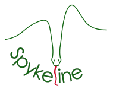
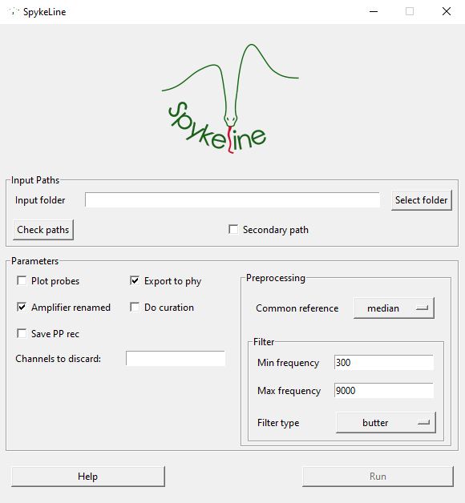

[](https://www.python.org/)

<p align="center">
  
</p>


# Spykeline

Spike sorting pipeline

## Contents

- [Installation](#installation)
  - [Instructions](#instructions)
  - [Requirements](#requirements)
- [Using Spykeline](#using-spykeline)
  - [Preparation](#preparation)
  - [Launching](#launching)


## Installation 

**Spykeline** is only supported by Windows 64-bit, a good RAM is advised, and a GPU is required depending on the sorter chosen.

### Instructions

1. Install [Anaconda](https://www.anaconda.com/download)
2. Open Anaconda prompt 
3. Create a new environment with `conda create --name spykeline python=3.9`.
4. Activate it `conda activate spykeline`.
5. Install **Git**, you can download it [here](https://git-scm.com/download/win), you can check the installation, by running `git --version` from Anaconda prompt, or any terminal.
6. Clone **Spykeline** repository locally, you can follow instructions [here](https://docs.github.com/fr/repositories/creating-and-managing-repositories/cloning-a-repository).
7. From the terminal, access the location of the cloned repository `cd /path/to/Spykeline`.
8. Install it `pip install .`.
9. Exit the folder `cd ..`.

The next 2 steps are optional as they depend on the sorter you choose to use (GPU/~GPU~ or Docker/~Docker~). You can find a list of available sorters on the [spikeinterface website](https://spikeinterface.readthedocs.io/en/stable/modules/sorters.html#). depending on the sorter you choose, you should check its GitHub repository for specific requirements. 

10. Optional: Install [Docker](#docker)
11. Optional: Install the [GPU requirements](#gpu-requirements)

### Requirements

#### Docker

Docker is used to run most sorters in a Virtual environment. If you don't have it yet installed, [download it](https://www.docker.com/), and follow the [installation instructions](https://docs.docker.com/desktop/install/windows-install/). 

#### GPU requirements

If not installed yet, install the NVIDIA driver corresponding to your GPU ([here](https://www.nvidia.com/Download/index.aspx?lang=en-us)). To access GPU information from the terminal, use `nvidia-smi`. You may also need to install the CUDA library, [CUDA 12.1](https://developer.nvidia.com/cuda-12-1-0-download-archive) recommended.

Install pyTorch `pip install torch --index-url https://download.pytorch.org/whl/cu121` (torchvision and torchaudio were removed as there are not used here). More information [here](https://pytorch.org/get-started/locally/).


## Using Spykeline

### Preparation

All input files needs to be in a **single folder**. Before launching Spykeline, it is necessary to prepare it properly. Here are presented all the needed files, with their related information. These files are the output of the recording device ([Intan](https://intantech.com/downloads.html?tabSelect=Software&yPos=0)) and the [Neuroscope software](https://neurosuite.sourceforge.net/).

#### Input Folder
##### Intan

Out of all the output from intan, only **2** files are of importance here :
- The concatenated recording (**.dat**), either named as the folder (i.e. folder is RatXXX_XXXXXX then the recording shall be **RatXXX_XXXXXX.dat**) either with its default name (**amplifier.dat**).
- **info.rhd**: information about the recording design. This file is the same as long as the recording devices (probes + intan) aren't modified. Most likely, all recordings will have this same file for the same animal.

##### Neuroscope

Neurscope allows you to group your channels according to your will, and once done, the configuration is saved in a .xml file (and .nrs file but not relevant here), and can be used for any other recording, as long as it has the same number of channel as the original one.  
Spykeline uses this configuration to create a virtual probe or a **channel map**, which is required by most if not all sorters. This is a crucial step, as a badly defined probe would lead to a sorting with poorly defined units. 

To well define this configuration, it is needed to group channels in both panels (see picture, blue and gold panels)


The blue panel  is called **Anatomical groups** and is where it is expected to group channel **per probe**.  
The gold panel  is called **Channels groups** and is where it is expected to group channels **per shank**.


> [!NOTE]
> This is the definition of these panels, in the end, the only need is that **one is grouped per probe and the other per shanks**, doesn't matter which

### Launching

To launch Spykeline, open **Anaconda prompt**, activate the Spykeline's environment, then run the following :

```bash
> run_spykeline
```

This will be launching the GUI, shown below.

<p align="center">
  
</p>

This is where the Spykeline's parameters are set, more information about the parameters [here](./spykeline/README.md) 
