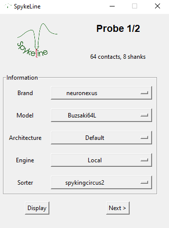
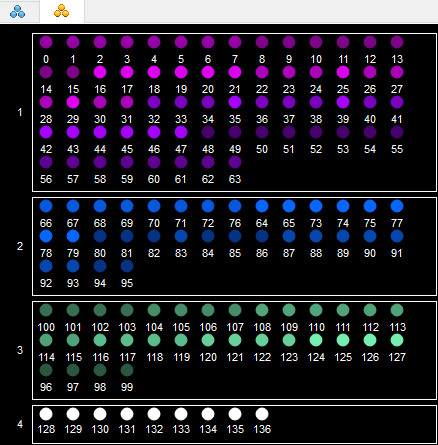
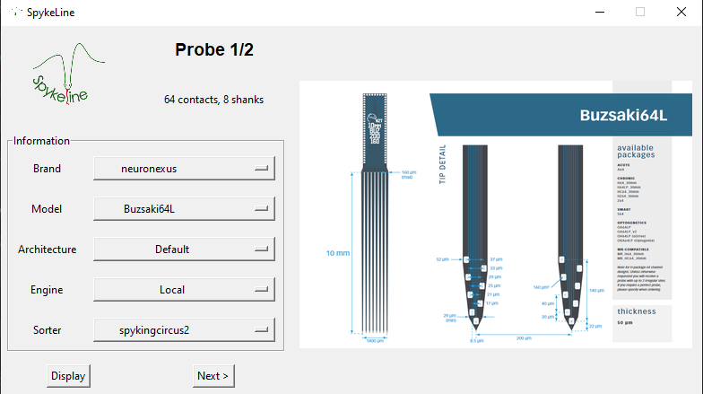

# Spykeline configuration

## Contents

- [Algorithm configuration](#Algorithm-configuration)
  - [Paths](#Paths)
  - [Sorter](#Sorter)
  - [Probe](#Probe)
  - [Parameters](#Parameters)
    - [General](#General)
    - [Preprocessing](#Preprocessing)
    - [Curation](#Curation)
- [Probe configuration](#Probe-configuration)
  - [Preparation](#preparation)
  - [Launching](#launching)

From this GUI, all the parameters for the algorithm are set, and once this is done, it will launch the windows for the [probes information](.preprocessing/README.md)!

  

# Algorithm configuration
## Paths

The GUI upper frame is the first to fill. 

It requires an **input path**, folder with input data (see instructions [here](../README.md#Input-Folder)). 

If you want to have Spykeline's results saved in a different folder than the input folder, then you can check ☑️ the **secondary path** option and a new path entry will appear.

  

Once the paths are entered, you need to click the "Check paths" button. This will check if the specified paths are correct, and if they exist. If the test is positive, then you can move on to the next section, and the run button will be unable.

## Sorter

Here, select the sorter you want to use. The sorters' parameters can be accessed and modified in [spikesorting/sorter_params](./spikesorting/sorter_params.py).

## Probe

The number of probes used in the recording to process. This number is used to set the [probes information](.preprocessing/README.md) later on. 

## Parameters

### General

- **`Plot_probes`** : False (default)

  Whether to plot the probes with the channel map. It can be useful to check that the channel map is correct.
  If set to `True`, the probe, created according to the .xml file, is plotted such as :
  
  

    
  

- **`Export_to_phy`** : True (default)
  Whether to export to phy, meaning making the output compatible with phy. Although some sorters (e.g. Kilosort) output is directly openable on phy, most other sorters aren't.
  If **`do_curation`** is set to `True`, then so is **`export_to_phy`**.
  Moreover, setting it to `True` uses Spykeline's exporter, with more customized information on phy.

- **`Amplifier_renamed`** : True (default)

  Whether your .dat file is renamed (e.g. RateXXX-YYYYMMDD) or not (amplifier.dat)

- **`Do_curation`** : True (default)

  Whether to cure the sorting after the spike sorting algorithm. If True, the curation frame appears, else disappears.
  This package has mainly been developed for this curation part, so setting it `True` is recommended.

### Preprocessing

- **`Common reference`** : median (default)

  Method to use for the common reference.

#### Filter

- **`Min frequency`** : 300 (default)

  Minimum frequency for the filter.

- **`Max frequency`** : 9000 (default)

  Maximum frequency for the filter.

- **`Filter type`** : butter (default)

  Type of filter to use.

> [!TIP]
> Setting both `Min frequency` and `Max frequency` will create a **bandpass** filter. Only setting `Max frequency` creates a **lowpass** filter and `Min frequency` creates a **highpass** filter.
  
### Curation

- **`Recursive`** : True (default)

  If set to `True`, the curation is said to be recursive, as it is curating the outputs of the curation as long as needed, else the curation is only run once, leading to a less elaborate result. Basically, loops on every cluster as long as it has   been identified

>[!IMPORTANT]
>Setting `Recursive` to True greatly increases Spykeline's running time, but provides a better output.

- **`Amplitude threshold`** : 5000 (default)

  Threshold on waveforms amplitude, to differentiate spikes from artifacts.

- **`Distribution threshold`** : 0.001 (default)

  Threshold on the distribution of spikes correlation with the unit template, proportion of spikes from the unit under which the spikes aren't considered part of the unit.

# Probe configuration

From the previously defined number of probes, such a window is created for each probe:

  

>[!Warning]
>On each window, the id of the probe is written (here 1) with the total number of probe (here 3). **Make sure** to fill the probes information in the same order than in Neuroscope.
>Example:
>

>Here, my first probe is a 64 channel one, so I will make sure to select a 64 channel geometry for the probe 1/3.

## Brand 

Select your probe's brand among the listed ones.

>[!NOTE]
>If your Probe is a **Tetrode**, select the brand "Other"!

## Model

Select your probe's model among the listed ones.

>[!TIP]
>Once the brand and the model selected, if you are unsure about it, you can click the "Display" button and the selected probe is shown such as:
>

